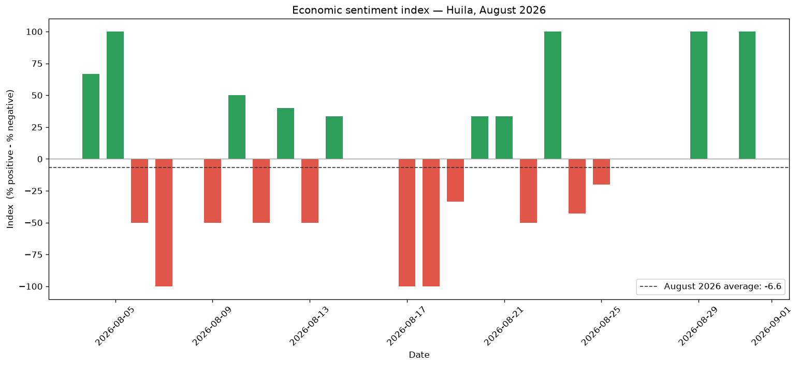

# Regional economic-sentiment index — Huila, Colombia

A **sentiment index** built from regional economic news, classifying each item with a Large Language Model (Google Gemini) and aggregating the result over time. A proof of concept covering regional news from two Huila outlets (93 unique economic news items across August and September 2026), analyzed on a **monthly basis**.

**Stack:** Python · pandas · Google Gemini · matplotlib

---

## Result



The index is defined as **`(% positive − % negative)`**, scaled −100…+100 — a single, transparent number with no analyst-defined weights.

In **v3**, the sentiment index and charts are generated **per selected month** (e.g., `mes = "2026-08"`), producing dedicated monthly outputs (`sentiment_index_08_2026.png`, `sentiment_index_weekly_08_2026.png`). This prevents the distortion of blending distinct periods into a single aggregate average that represents no individual month well.

> **On the daily chart:** with only a few news items per day, the daily index takes coarse values (−100, 0, +50, +100…) and rarely sits exactly on the monthly average. This is sampling volatility, not noise in the method — the signal lives in the aggregate, not in any single day. The notebook also includes a **weekly aggregation** chart to smooth the series across the month.

## How the news is captured

News is collected in a separate step from two regional outlets (*Diario La Nación*, *Diario del Huila*), filtered to keep only substantive economic items, and exported as a dataset (`data.xlsx`, included here). This repository focuses on the **analysis**; the scraping code is kept private.

## How it differs from the national benchmark

Banco de la República's national sentiment index uses **dictionary methods** — predefined positive/negative word lists (Mora-Quiñones, Orozco-Gallo & Mora-Pérez, *Sentiment and Uncertainty Indices from economic news in Colombia*, Borradores de Economía No. 1340, 2026 — [full text](https://repositorio.banrep.gov.co/server/api/core/bitstreams/5106d21e-a8ba-4ea4-b5ff-9596939ebc04/content)). This project deliberately takes a different route:

| | National benchmark | This project |
|---|---|---|
| Classification | Word-list dictionary | **LLM (reads context)** |
| Scope | National | **Regional — Huila** |
| Weighting | — | Simple count (fewer assumptions) |

**Why an LLM over dictionaries:** a word-count method can misread *"no hubo crisis"* (no crisis) as negative; the LLM classifies the sentence in context.

## Limitations (stated on purpose)

- **Source bias:** two outlets, one region → not nationally representative; each paper's editorial line colors the result.
- **Still a small sample:** 93 items over ~2 months → a proof of concept, not a robust index. More outlets and history would strengthen it.
- **Model dependence:** classification reflects the LLM's judgment; a few borderline items may flip.

Declaring these limits is part of the method — a sentiment index is only as representative as its sources.

### How this evolved

| Run | Approach | Sample | Period | Sentiment index |
|---|---|---|---|---|
| v1 | Monolithic run | 43 items | Jul 2026 | −2.3 |
| v2 | Monolithic run | 93 items | Aug-Sep 2026 | −3.2 (blended average) |
| v3 | **Monthly index** | 93 items | **Aug 2026**<br>**Sep 2026** | **−6.6** (76 items)<br>**+11.8** (17 items) |

The v1 and v2 files are preserved in this repository (`*_v1.*` and base files) as a historical record. Growing the sample and refining the architecture is part of the methodology, not something to quietly overwrite.

### Architecture in v3: Monthly Index vs. Full-History Baseline

A core design decision in **v3** separates the monthly index calculation from model training:

1. **Monthly sentiment index (`sentiment_index.ipynb`):** The index and output charts are scoped strictly to the selected month (`mes = "YYYY-MM"`). Blending August (−6.6) and September (+11.8) together in v2 produced an artificial −3.2 average ("sancocho") that misrepresented both months. Evaluating each month independently provides accurate economic signal.
2. **Full-history training for classic NLP (`classic_nlp_tfidf.ipynb`):** While sentiment indices must be period-specific, machine learning baselines benefit from more training data. The entire cumulative historical dataset (`data_labeled.csv`, 93 items across all months) is used to train and evaluate the TF-IDF + Naive Bayes classifier.

## Bonus: a classic NLP baseline

`classic_nlp_tfidf.ipynb` takes the same news and the same sentiment labels, but classifies them with the traditional NLP pipeline instead of an LLM call: **TF-IDF vectorization + Multinomial Naive Bayes**, evaluated with stratified 5-fold cross-validation on the full cumulative history (the sample is too small for a held-out test split). It also shows the most informative words per class — something an LLM call doesn't hand you for free.

| | LLM (`sentiment_index.ipynb`) | Classic (`classic_nlp_tfidf.ipynb`) |
|---|---|---|
| How it reads text | Full context | Bag-of-words (TF-IDF) |
| Cost per run | API calls | Free, runs offline |
| Interpretability | Black box | Inspectable feature weights |
| Handles negation (*"no hubo crisis"*) | Yes | No — known blind spot |

The classic model is trained on the LLM's own labels (a *distillation*, not an independent gold standard) — see that notebook's Limitations section for what that does and doesn't prove.

**Real result, v1 → v2/v3:**

| Run | Sample | Accuracy | "neutral" precision/recall |
|---|---|---|---|
| v1 | 43 items (8 neutral) | 44% | 0.00 / 0.00 |
| v2 / v3 | 93 items (14 neutral) | 56% | 0.00 / 0.00 |

More than doubling the sample raised overall accuracy, but the model **still never predicts "neutral"** even with 14 examples — with negativo/positivo staying the safer bet at that ratio, the classifier keeps collapsing the minority class into its neighbors. It's an honest, expected failure mode for bag-of-words on a small, imbalanced sample, not a hidden bug — reported here rather than smoothed over.

## Run it

```bash
pip install -r requirements.txt
```

1. Open `sentiment_index.ipynb`:
   - Set `mes = "2026-08"` (or any `YYYY-MM` month present in `data.xlsx`).
   - Run all cells. It uses existing cached labels from `data_labeled.csv` if available, only calling Gemini for new unclassified items.
   - It computes the monthly index and generates `sentiment_index_<month>_<year>.png` and `sentiment_index_weekly_<month>_<year>.png`.
   - All labeled news are accumulated back into `data_labeled.csv`.

2. Open `classic_nlp_tfidf.ipynb`:
   - Run all cells — no API key needed, it reuses the full accumulated `data_labeled.csv` to train and evaluate the classic baseline.

---

Gabriel Andrés Salazar Espinosa · [maximumtech17.github.io](https://maximumtech17.github.io)
