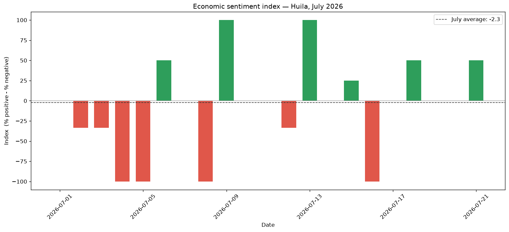

# Regional economic-sentiment index — Huila, Colombia

A **sentiment index** built from regional economic news, classifying each item with a Large Language Model (Google Gemini) and aggregating the result over time. A proof of concept over July 2026 (~43 unique economic news items from two Huila outlets).

**Stack:** Python · pandas · Google Gemini · matplotlib

---

## Result



The index is defined as **`(% positive − % negative)`**, scaled −100…+100 — a single, transparent number with no analyst-defined weights. The chart shows its daily evolution across the month, with the monthly average as a dashed line.

> **On the daily chart:** with only a few news items per day, the daily index can only take coarse values (−100, 0, +50, +100…) and never sits exactly on the monthly average. This is sampling volatility, not noise in the method — the signal lives in the aggregate, not in any single day. The notebook includes an optional cell to aggregate **weekly or monthly**, which smooths the series as the sample grows.

## How the news is captured

News is collected in a separate step from two regional outlets (*Diario La Nación*, *Diario del Huila*), filtered to keep only substantive economic items, and exported as a dataset (`data.xlsx`, included here). This repository focuses on the **analysis**; the scraping code is kept private.

## How it differs from the national benchmark

Banco de la República's national sentiment index uses **dictionary methods** — predefined positive/negative word lists (Mora-Quiñones, Orozco-Gallo & Mora-Pérez, *Sentiment and Uncertainty Indices from economic news in Colombia*, Borradores de Economía No. 1340, 2026 — [full text](https://repositorio.banrep.gov.co/server/api/core/bitstreams/5106d21e-a8ba-4ea4-b5ff-9596939ebc04/content)). This project deliberately takes a different route:

| | National benchmark | This project |
|---|---|---|
| Classification | Word-list dictionary | **LLM (reads context)** |
| Scope | National | **Regional — Huila** |
| Weighting | — | Simple count (fewer assumptions) |

**Why an LLM over dictionaries:** a word-count method can misread *"no hubo crisis"* (no crisis) as negative; the LLM classifies the sentence in context.

## Limitations (stated on purpose)

- **Source bias:** two outlets, one region → not nationally representative; each paper's editorial line colors the result.
- **Small sample:** ~43 items over three weeks → a proof of concept, not a robust index. More outlets and history would strengthen it.
- **Model dependence:** classification reflects the LLM's judgment; a few borderline items may flip.

Declaring these limits is part of the method — a sentiment index is only as representative as its sources.

## Run it

```bash
pip install -r requirements.txt
```
Open `sentiment_index.ipynb` and run all cells (you'll be asked for your own Gemini API key). It reads `data.xlsx`, classifies each item and rebuilds the index and chart.

---

Gabriel Andrés Salazar Espinosa · [maximumtech17.github.io](https://maximumtech17.github.io)
